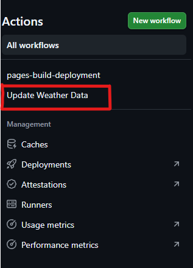
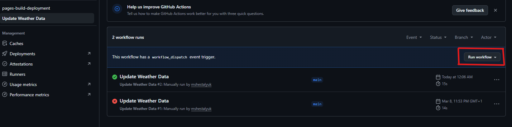
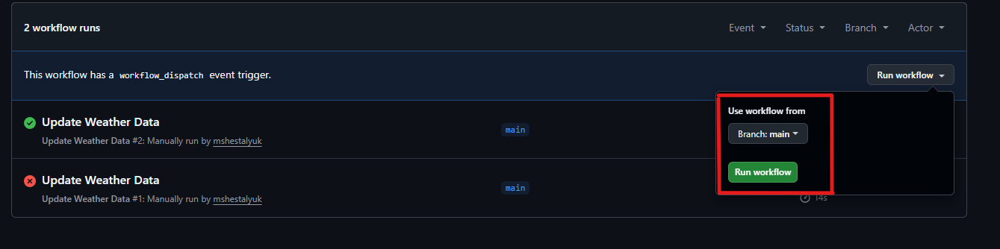

# 🌤️ Cracow Weather Dashboard

A static weather dashboard for Cracow, Poland — automatically updated every hour via GitHub Actions and served through GitHub Pages.

## 🔗 Live Site

👉 **[View the live dashboard](https://mshestalyuk.github.io/weather-displayer/)**

---

## 📡 Data Source

This project uses the **[Open-Meteo API](https://open-meteo.com/)** — a free, open-source weather API that requires **no API key** and **no registration**.

**Why Open-Meteo?**
- Completely free with no rate limits for reasonable usage
- No authentication required — perfect for GitHub Actions
- Provides current weather + 7-day forecast
- High-quality data sourced from national weather services
- Covers Cracow coordinates (50.0647°N, 19.9450°E)

---

## ⚙️ How It Works

1. **GitHub Actions** runs on a cron schedule (every hour) or on manual trigger
2. A **Python script** (`update_weather.py`) fetches fresh weather data from the Open-Meteo API
3. The script generates a styled **`index.html`** page with current conditions and a 7-day forecast
4. The workflow **commits and pushes** the updated HTML file
5. **GitHub Pages** automatically deploys the new version

---

## 🚀 How to Run the Workflow Manually

1. Go to the **Actions** tab of this repository

2. Select **"Update Weather Data"** from the left sidebar

3. Click the **"Run workflow"** button on the right

4. Select the branch (default: `main`) and click **"Run workflow"**

---

## 📊 What's Displayed

| Section            | Details                                              |
|--------------------|------------------------------------------------------|
| Current Weather    | Temperature, feels-like, humidity, wind, conditions   |
| Today's Summary    | High/low temperature, precipitation, sunrise/sunset   |
| 7-Day Forecast     | Daily high/low, weather condition, precipitation      |
| Last Updated       | Timestamp of the most recent data fetch              |